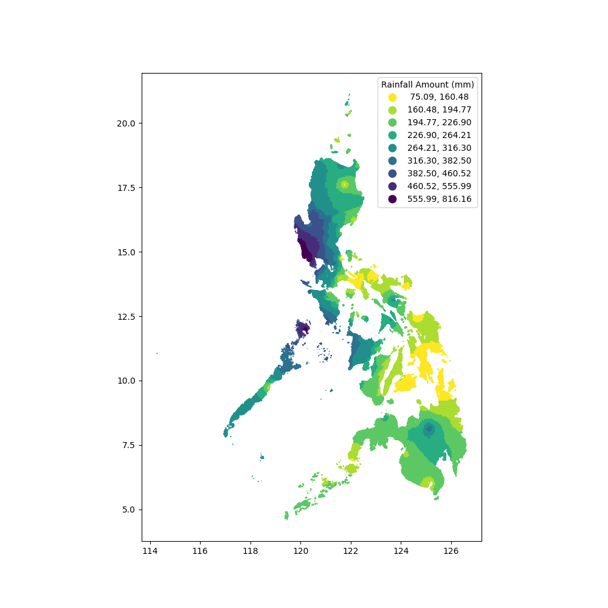

# Overview

A geospatial map visualizing the monthly rainfall amount in the Philippines. Rainfall data from 2009 to 2019 from multiple weather stations situated in the country were collected and stored in a Postgres Database. 

To estimate the rainfall distribution throughout the entire country, the inverse distance weighting (IDW) was used. It was implemented using  SKlearn's KNN implementation. The limitation of this method is it does not consider the elevation of the weather stations. 

## Data

Data Sources:

* PAG-ASA rainfall data: [Excel file](./raw_files/PAG-ASA/Summarized_Rainfall_Data.xlsx) was requested from PAG-ASA

* AGROMET rainfall data: [CSV files](./raw_files/Agromet) were taken from [agromet.da.gov.ph](https://agromet.da.gov.ph/)

* Philippines Shapefile: PH_Adm2_ProvDists.shp was taken from [philippines-psgc-shapefiles](https://github.com/altcoder/philippines-psgc-shapefiles) Github repository

## Results

#### Sample static map

